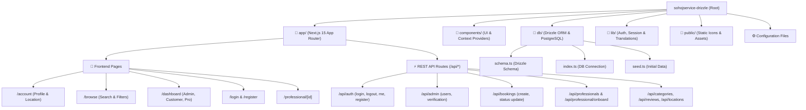

# Sohoj Service — Project Directory Graph & Developer Guide

This document provides a comprehensive map of the **Sohoj Service** codebase, detailing the purpose of every folder and file, how components communicate, and where to make changes when adding or modifying features.

---

## 🗺️ High-Level System Architecture



---

## 📂 Complete Directory Tree

```
sohojservice-drizzle/
├── 📁 app/
│   ├── 📁 account/
│   │   └── page.tsx                      # User profile & location settings page
│   ├── 📁 api/
│   │   ├── 📁 account/
│   │   │   ├── 📁 location/
│   │   │   │   └── route.ts              # Update GPS latitude & longitude API
│   │   │   └── route.ts                  # Update user profile details API
│   │   ├── 📁 admin/
│   │   │   ├── 📁 professionals/
│   │   │   │   └── 📁 [id]/
│   │   │   │       └── route.ts          # Admin verification & toggle for professionals
│   │   │   └── 📁 users/
│   │   │       ├── 📁 [id]/
│   │   │       │   └── route.ts          # Admin edit/delete user API
│   │   │       └── route.ts              # Admin fetch all users API
│   │   ├── 📁 auth/
│   │   │   ├── 📁 forgot-password/
│   │   │   │   └── route.ts              # Generate 6-digit reset code (excludes admin)
│   │   │   ├── 📁 reset-password/
│   │   │   │   └── route.ts              # Verify code & update user password hash
│   │   │   ├── 📁 login/
│   │   │   │   └── route.ts              # User login & JWT cookie creation
│   │   │   ├── 📁 logout/
│   │   │   │   └── route.ts              # Logout & cookie clearance
│   │   │   ├── 📁 me/
│   │   │   │   └── route.ts              # Current session check endpoint
│   │   │   └── 📁 register/
│   │   │       └── route.ts              # Real email verified user registration endpoint
│   │   ├── 📁 bookings/
│   │   │   ├── 📁 [id]/
│   │   │   │   └── route.ts              # Booking status update (Accept/Decline/Complete)
│   │   │   └── route.ts                  # Create booking & fetch user bookings
│   │   ├── 📁 categories/
│   │   │   └── route.ts                  # Fetch all service categories
│   │   ├── 📁 instant-bookings/
│   │   │   ├── 📁 [id]/
│   │   │   │   └── route.ts              # Admin update instant booking status & notes
│   │   │   └── route.ts                  # Public submit instant booking / Admin fetch all
│   │   ├── 📁 locations/
│   │   │   └── 📁 upazilas/
│   │   │       └── route.ts              # Bangladesh Upazilas & Districts API
│   │   ├── 📁 professional/
│   │   │   └── 📁 onboard/
│   │   │       └── route.ts              # Upgrade customer account to professional
│   │   ├── 📁 professionals/
│   │   │   ├── 📁 [id]/
│   │   │   │   └── route.ts              # Fetch single professional profile with reviews
│   │   │   └── route.ts                  # Filtered search API (category, location, query)
│   │   └── 📁 reviews/
│   │       └── route.ts                  # Post new customer rating & review
│   ├── 📁 browse/
│   │   └── page.tsx                      # Browse & filter professionals list page
│   ├── 📁 dashboard/
│   │   ├── 📁 admin/
│   │   │   └── page.tsx                  # Admin dashboard (users, approvals, stats)
│   │   ├── 📁 customer/
│   │   │   └── page.tsx                  # Customer dashboard (active & past bookings)
│   │   └── 📁 professional/
│   │       └── page.tsx                  # Pro dashboard (incoming jobs, availability)
│   ├── 📁 instant-book/
│   │   └── page.tsx                      # Public instant emergency booking page (No login required)
│   ├── 📁 login/
│   │   └── page.tsx                      # Sign in page
│   ├── 📁 professional/
│   │   └── 📁 [id]/
│   │       └── page.tsx                  # Public professional profile & booking modal
│   ├── 📁 register/
│   │   └── page.tsx                      # User registration page
│   ├── favicon.ico                       # Website favicon icon
│   ├── globals.css                       # Global styles & Tailwind/CSS variables
│   ├── layout.tsx                        # Root layout (wraps Auth, Lang providers, Nav, Footer)
│   └── page.tsx                          # Homepage (Hero, Categories, Features, AI Assistant)
├── 📁 components/
│   ├── AuthProvider.tsx                  # Context provider for managing logged-in state
│   ├── BangladeshUpazilaInput.tsx        # Searchable selector for 64 districts & all upazilas
│   ├── BrandLogo.tsx                     # Sohoj Service brand logo component
│   ├── CategoryGrid.tsx                  # Service category grid cards on homepage
│   ├── Footer.tsx                        # Site-wide footer with links & copyright
│   ├── HomeHero.tsx                      # Landing page hero banner & quick search bar
│   ├── HowItWorks.tsx                    # 3-step guide explaining how booking works
│   ├── LanguageProvider.tsx              # Context provider for bilingual toggle (EN / BN)
│   ├── MapPreview.tsx                    # OpenStreetMap / Leaflet preview for GPS locations
│   ├── Navbar.tsx                        # Site navigation bar with auth & language controls
│   ├── ProfilePhoto.tsx                  # Avatar component with image fallback
│   └── SirajganjUpazilaInput.tsx         # Sirajganj specific upazila selector
├── 📁 db/
│   ├── index.ts                          # Drizzle ORM client initialization
│   ├── schema.ts                         # PostgreSQL database tables & relations definition
│   └── seed.ts                           # Database seeding script for initial data
├── 📁 lib/
│   ├── auth.ts                           # Password hashing (bcrypt) & credential verification
│   ├── dictionary.ts                     # Bilingual localization dictionary (English & Bangla)
│   ├── locations.ts                      # Bangladesh districts & upazilas dataset & geocoding
│   └── session.ts                        # JWT session token generator and verification
├── 📁 public/
│   ├── file.svg                          # Vector icon asset
│   ├── globe.svg                         # Vector icon asset
│   ├── next.svg                          # Next.js logo
│   ├── vercel.svg                        # Vercel logo
│   └── window.svg                        # Vector icon asset
├── .env                                  # Environment variables (Database URL, JWT Secret)
├── .gitignore                            # Git ignore rules
├── AGENTS.md                             # Agent guidelines
├── CLAUDE.md                             # Claude development notes
├── drizzle.config.ts                     # Drizzle Kit configuration for migrations
├── eslint.config.mjs                     # ESLint configuration
├── next.config.ts                        # Next.js framework configuration
├── next-env.d.ts                         # Next.js TypeScript declarations
├── package.json                          # Dependencies & build scripts
├── postcss.config.mjs                    # PostCSS plugins configuration
├── proxy.ts                              # Middleware route protection for dashboards
├── README.md                             # Original project overview
└── tsconfig.json                         # TypeScript compiler configuration
```

---

## 🛠️ Detailed File Reference & Modification Guide

### 1. Database & Data Models (`db/`)
* **[`db/schema.ts`](file:///c:/Users/sumon/Desktop/KYAU/WEB%20ENGINEERING/sohojservice-drizzle/db/schema.ts)**
  * **What it does**: Defines database tables using Drizzle ORM (`users`, `categories`, `professionalProfiles`, `bookings`, `reviews`) and enum types (`roleEnum`, `bookingStatusEnum`).
  * **When to edit**: Modify when adding new fields (e.g. adding hourly rates, WhatsApp number, portfolio images, new statuses).
* **[`db/index.ts`](file:///c:/Users/sumon/Desktop/KYAU/WEB%20ENGINEERING/sohojservice-drizzle/db/index.ts)**
  * **What it does**: Connects to the PostgreSQL / Neon database using `@neondatabase/serverless` and exports the `db` instance.
  * **When to edit**: Modify if changing database drivers, pooling configuration, or SSL settings.
* **[`db/seed.ts`](file:///c:/Users/sumon/Desktop/KYAU/WEB%20ENGINEERING/sohojservice-drizzle/db/seed.ts)**
  * **What it does**: Seeds categories (Electrician, Plumber, Home Tutor, AC Repair, etc.) and mock users.
  * **When to edit**: Modify to add default categories or default demo accounts.

---

### 2. Authentication & Core Helpers (`lib/`)
* **[`lib/auth.ts`](file:///c:/Users/sumon/Desktop/KYAU/WEB%20ENGINEERING/sohojservice-drizzle/lib/auth.ts)**
  * **What it does**: Handles password hashing (`hashPassword`), password verification (`verifyPassword`), and authentication validation logic.
  * **When to edit**: Modify if changing password validation rules, salt rounds, or adding OAuth.
* **[`lib/session.ts`](file:///c:/Users/sumon/Desktop/KYAU/WEB%20ENGINEERING/sohojservice-drizzle/lib/session.ts)**
  * **What it does**: Signs and verifies JWT session tokens stored in HTTP-only cookies.
  * **When to edit**: Modify if changing token expiration time, cookie names, or adding custom claims.
* **[`lib/dictionary.ts`](file:///c:/Users/sumon/Desktop/KYAU/WEB%20ENGINEERING/sohojservice-drizzle/lib/dictionary.ts)**
  * **What it does**: Contains translation strings for both English (`en`) and Bangla (`bn`).
  * **When to edit**: Modify whenever you add new buttons, headings, error messages, or text to translate.

---

### 3. Frontend Pages (`app/`)
* **[`app/page.tsx`](file:///c:/Users/sumon/Desktop/KYAU/WEB%20ENGINEERING/sohojservice-drizzle/app/page.tsx)**: Homepage containing hero banner, category selector, how-it-works cards, and CTA.
* **[`app/browse/page.tsx`](file:///c:/Users/sumon/Desktop/KYAU/WEB%20ENGINEERING/sohojservice-drizzle/app/browse/page.tsx)**: Search page allowing customers to filter professionals by category, upazila, availability, and GPS distance.
* **[`app/professional/[id]/page.tsx`](file:///c:/Users/sumon/Desktop/KYAU/WEB%20ENGINEERING/sohojservice-drizzle/app/professional/[id]/page.tsx)**: Public professional profile showing bio, rate, reviews, rating, and the booking request form.
* **[`app/account/page.tsx`](file:///c:/Users/sumon/Desktop/KYAU/WEB%20ENGINEERING/sohojservice-drizzle/app/account/page.tsx)**: User account settings to update name, phone, password, and live GPS coordinates.
* **[`app/dashboard/admin/page.tsx`](file:///c:/Users/sumon/Desktop/KYAU/WEB%20ENGINEERING/sohojservice-drizzle/app/dashboard/admin/page.tsx)**: Admin control panel to verify professionals, manage user roles, and monitor bookings.
* **[`app/dashboard/customer/page.tsx`](file:///c:/Users/sumon/Desktop/KYAU/WEB%20ENGINEERING/sohojservice-drizzle/app/dashboard/customer/page.tsx)**: Customer dashboard displaying current booking requests and ability to leave reviews.
* **[`app/dashboard/professional/page.tsx`](file:///c:/Users/sumon/Desktop/KYAU/WEB%20ENGINEERING/sohojservice-drizzle/app/dashboard/professional/page.tsx)**: Professional portal to accept/decline service calls, update visit rates, and toggle availability.
* **[`app/login/page.tsx`](file:///c:/Users/sumon/Desktop/KYAU/WEB%20ENGINEERING/sohojservice-drizzle/app/login/page.tsx)** & **[`app/register/page.tsx`](file:///c:/Users/sumon/Desktop/KYAU/WEB%20ENGINEERING/sohojservice-drizzle/app/register/page.tsx)**: Sign in and account registration workflows.

---

### 4. Backend API Routes (`app/api/`)
* **`app/api/auth/*`**:
  * **[`login/route.ts`](file:///c:/Users/sumon/Desktop/KYAU/WEB%20ENGINEERING/sohojservice-drizzle/app/api/auth/login/route.ts)**: Validates credentials and sets JWT session cookie.
  * **[`register/route.ts`](file:///c:/Users/sumon/Desktop/KYAU/WEB%20ENGINEERING/sohojservice-drizzle/app/api/auth/register/route.ts)**: Creates user records and handles initial role assignment.
  * **[`logout/route.ts`](file:///c:/Users/sumon/Desktop/KYAU/WEB%20ENGINEERING/sohojservice-drizzle/app/api/auth/logout/route.ts)**: Clears authentication session.
  * **[`me/route.ts`](file:///c:/Users/sumon/Desktop/KYAU/WEB%20ENGINEERING/sohojservice-drizzle/app/api/auth/me/route.ts)**: Returns currently logged-in user profile.
* **`app/api/professionals/*`**:
  * **[`route.ts`](file:///c:/Users/sumon/Desktop/KYAU/WEB%20ENGINEERING/sohojservice-drizzle/app/api/professionals/route.ts)**: Searches professionals with geo-distance calculation.
  * **[`[id]/route.ts`](file:///c:/Users/sumon/Desktop/KYAU/WEB%20ENGINEERING/sohojservice-drizzle/app/api/professionals/[id]/route.ts)**: Returns single professional's full profile and reviews.
  * **[`professional/onboard/route.ts`](file:///c:/Users/sumon/Desktop/KYAU/WEB%20ENGINEERING/sohojservice-drizzle/app/api/professional/onboard/route.ts)**: Upgrades customer account to a professional profile.
* **`app/api/bookings/*`**:
  * **[`route.ts`](file:///c:/Users/sumon/Desktop/KYAU/WEB%20ENGINEERING/sohojservice-drizzle/app/api/bookings/route.ts)**: POST creates a booking; GET fetches user's bookings.
  * **[`[id]/route.ts`](file:///c:/Users/sumon/Desktop/KYAU/WEB%20ENGINEERING/sohojservice-drizzle/app/api/bookings/[id]/route.ts)**: Updates status (`ACCEPTED`, `DECLINED`, `COMPLETED`, `CANCELLED`).
* **`app/api/admin/*`**:
  * **[`users/route.ts`](file:///c:/Users/sumon/Desktop/KYAU/WEB%20ENGINEERING/sohojservice-drizzle/app/api/admin/users/route.ts)** & **[`users/[id]/route.ts`](file:///c:/Users/sumon/Desktop/KYAU/WEB%20ENGINEERING/sohojservice-drizzle/app/api/admin/users/[id]/route.ts)**: Manage all accounts.
  * **[`professionals/[id]/route.ts`](file:///c:/Users/sumon/Desktop/KYAU/WEB%20ENGINEERING/sohojservice-drizzle/app/api/admin/professionals/[id]/route.ts)**: Verify / unverify professional badge.
* **`app/api/reviews/route.ts`**: Saves ratings & feedback after completed services.
* **`app/api/categories/route.ts`**: Returns available service categories.
* **`app/api/locations/upazilas/route.ts`**: Provides district & upazila list for dropdowns.

---

### 5. UI Components (`components/`)
* **[`components/Navbar.tsx`](file:///c:/Users/sumon/Desktop/KYAU/WEB%20ENGINEERING/sohojservice-drizzle/components/Navbar.tsx)**: Top navigation bar with logo, links, dashboard dropdowns, and language switch.
* **[`components/Footer.tsx`](file:///c:/Users/sumon/Desktop/KYAU/WEB%20ENGINEERING/sohojservice-drizzle/components/Footer.tsx)**: Footer component with branding and service links.
* **[`components/AuthProvider.tsx`](file:///c:/Users/sumon/Desktop/KYAU/WEB%20ENGINEERING/sohojservice-drizzle/components/AuthProvider.tsx)**: React Context providing `user`, `role`, `login`, and `logout` to all client components.
* **[`components/LanguageProvider.tsx`](file:///c:/Users/sumon/Desktop/KYAU/WEB%20ENGINEERING/sohojservice-drizzle/components/LanguageProvider.tsx)**: React Context providing `lang` ('en' | 'bn') and `t` dictionary helper.
* **[`components/BangladeshUpazilaInput.tsx`](file:///c:/Users/sumon/Desktop/KYAU/WEB%20ENGINEERING/sohojservice-drizzle/components/BangladeshUpazilaInput.tsx)**: Searchable dropdown supporting all Bangladesh upazilas & districts in Bangla/English.
* **[`components/SirajganjUpazilaInput.tsx`](file:///c:/Users/sumon/Desktop/KYAU/WEB%20ENGINEERING/sohojservice-drizzle/components/SirajganjUpazilaInput.tsx)**: Specific selector for Sirajganj sub-districts.
* **[`components/HomeHero.tsx`](file:///c:/Users/sumon/Desktop/KYAU/WEB%20ENGINEERING/sohojservice-drizzle/components/HomeHero.tsx)**: Landing page banner with search inputs and geolocation button.
* **[`components/CategoryGrid.tsx`](file:///c:/Users/sumon/Desktop/KYAU/WEB%20ENGINEERING/sohojservice-drizzle/components/CategoryGrid.tsx)**: Interactive grid displaying service category cards.
* **[`components/HowItWorks.tsx`](file:///c:/Users/sumon/Desktop/KYAU/WEB%20ENGINEERING/sohojservice-drizzle/components/HowItWorks.tsx)**: Visual explanation of the platform's booking steps.
* **[`components/MapPreview.tsx`](file:///c:/Users/sumon/Desktop/KYAU/WEB%20ENGINEERING/sohojservice-drizzle/components/MapPreview.tsx)**: Interactive OpenStreetMap rendering professional locations.
* **[`components/ProfilePhoto.tsx`](file:///c:/Users/sumon/Desktop/KYAU/WEB%20ENGINEERING/sohojservice-drizzle/components/ProfilePhoto.tsx)**: User photo avatar with fallback initials.
* **[`components/BrandLogo.tsx`](file:///c:/Users/sumon/Desktop/KYAU/WEB%20ENGINEERING/sohojservice-drizzle/components/BrandLogo.tsx)**: Reusable Sohoj Service logo.

---

### 6. Configuration & Middleware
* **[`proxy.ts`](file:///c:/Users/sumon/Desktop/KYAU/WEB%20ENGINEERING/sohojservice-drizzle/proxy.ts)**: Middleware proxy protecting `/dashboard/*` routes for authenticated sessions.
* **[`drizzle.config.ts`](file:///c:/Users/sumon/Desktop/KYAU/WEB%20ENGINEERING/sohojservice-drizzle/drizzle.config.ts)**: Configures Drizzle Kit schema path and PostgreSQL database credentials.
* **[`next.config.ts`](file:///c:/Users/sumon/Desktop/KYAU/WEB%20ENGINEERING/sohojservice-drizzle/next.config.ts)**: Next.js settings and image domain configurations.
* **[`package.json`](file:///c:/Users/sumon/Desktop/KYAU/WEB%20ENGINEERING/sohojservice-drizzle/package.json)**: Scripts (`dev`, `build`, `db:push`, `db:studio`, `db:seed`) and project dependencies.
* **[`.env`](file:///c:/Users/sumon/Desktop/KYAU/WEB%20ENGINEERING/sohojservice-drizzle/.env)**: Environment variables (`DATABASE_URL`, `JWT_SECRET`).
